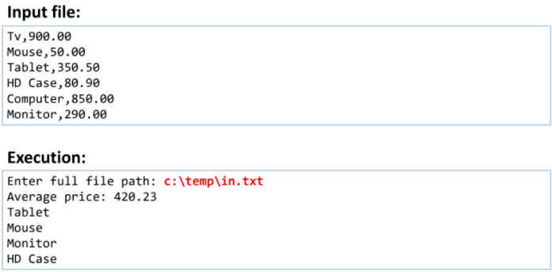

<h1>Exercício</h1>
Fazer um programa para ler um conjunto de produtos a partir de um
arquivo em formato .csv (suponha que exista pelo menos um produto).
Em seguida mostrar o preço médio dos produtos. Depois, mostrar os
nomes, em ordem decrescente, dos produtos que possuem preço
inferior ao preço médio.

